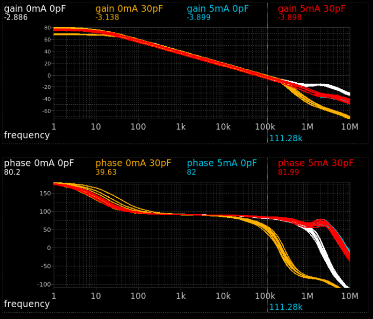

# SKY130 LDO with Folded Cascode OTA
Output-capless LDO for low-power source voltage generation. The error amplifier is a folded cascode OTA. OTA and the constant current source have been designed for operation in the $V_{CC}$ range 0.9 V to 1.8 V. The LDO operates in the region $V_{CC}$ = 1.5 V  to 1.95 V. The LDO is stable in the output current range 0 mA to 5 mA without load capacitance. 

# Design Method
## Specification
The LDO should have the following parameters:  
- $I_{q} = 1..2 \texttt{µA}$
- $I_{out} = 0..5 \texttt{mA}$
- $C_L = 0..20 \texttt{pF}$
- Usage of low noise methods
- No resistors

## Design idea
Since the current of the LDO is already defined, the OTA can be designed to use the maximum quiescent current to maximize gain. The LDO should be biased in moderate inversion to increase $g_m/I_d$ efficiency, and these MOSFETs provide a low thermal noise. First a resistor-less current reference is designed. Then, the OTA is designed for high swing and high input common mode voltage (NMOS input pair, also better for PSRR) with the plan to drive the LDO output using a PMOS. For low-noise, long channel mosfets have been used. At the end, the LDO with PMOS output can be designed, and compensated. 

## Note about binned models
The SKY130 PDK has binned MOSFET SPICE models. Only the binned components have been used for simulation, a list for the nominal NMOS can be found at: https://github.com/google/skywater-pdk-libs-sky130_fd_pr/blob/f62031a1be9aefe902d6d54cddd6f59b57627436/cells/nfet_01v8/sky130_fd_pr__nfet_01v8.bins.csv 

## Current source
Design of the current source with a bias current of $50..100 \texttt{nA}$.  
The micropower current reference shown in https://ieeexplore.ieee.org/abstract/document/597305/ has been used as reference design, it is built for a current range of $1..100 \texttt{nA}$ and works with a source voltage from $1.2\texttt{V}$. The final design works from $0.8 \texttt{V}$ and typical $45 \texttt{nA}$.  
The current for a curcuit with feedback resistor can be calculated by $I_{b} = \frac{2}{\mu_n C_{ox} (W/L)_n}\frac{1}{R^2} \left(1- \frac{1}{\sqrt{K}} \right)^2$. Therefore, the current is a function of the NMOS dimensions W/L, the multiplication factor K, and the resistor R. For low noise, the current source has been designed with long channel MOSFETs. First, the circuit with resistor has been simulated with a resistor voltage of $50 \texttt{mV}$. Secondly, a long-channel MOSFET with a similar resistor value in the linear operating region replaces the resistor. 

## Folded Cascode OTA
Previous research has shown that the folded cascode OTA is the most used amplifier for LDO designs in the specified operating range, since it is the simplest single-stage amp for low power. As a starting point, the cascode currents have been defined to be around $1 \mu \texttt{A}$. MOSFETs have been dimensioned to deliver the defined current in weak inversion and saturation. Weak inversion biasing has been chosen since the $g_m/I_d$ efficiency is higher than in strong inversion, and low overdrive voltages ensure wide swing operation. The input pair has been dimensioned to have high width and high gain, since this will dominate the OTA gain. From this point, the design has been optimized to increase gain and to reduce the effect of the additional parasitic pole/zero pair. Long channels at the top and bottom cascode mosfets to increase $r_o$, high gain in the middle mosfets, and similar gain in the middle MOSFETs. All MOSFETs are in saturation in the operating region where gain is maximized.

## LDO
The power transistor has been dimensioned to deliver 5 mA at 200 mV dropout voltage with `hvt` doping to increase performance in low output current corners. Then, the LDO has been simulated and a stability analysis has been performed. Based on this simulation, cascode compensation has been implemented to keep the LDO in a safe operating area at zero load where the high on-resistance of the power PMOS induces a low-frequency pole.

# Simulation parameters
|Parameter| Min | Typ | Max
|---|---|---|---|
| $V_{DD}$ (V) | 1.5  | 1.8 | 1.95 |
| $V_{ref}$ (V) | 0.4 | ($V_{out}$ - $V_{dropout}$)/2 | 0.975 |
| $V_{out}$ (V) | 0.8 | $2 \cdot V_{ref}$ | 1.95 |
| $V_{dropout}$ (mV) | 60 $^a$ | - | 200 $^b$|
| $I_{out}$ (mA) | 0 |-| 5 |
| $C_{load}$ (pF) | 0 | - | 30 |  
| $I_{q}$ (µA)   | 1 $^b$ |2| 3.25 $^a$ | 
| DC gain (dB)   | 65 | - | 80 | 
| Unit gain BW (kHz)   | 96 | 100 | 217 | 
| Phase margin (°)   | $25^c$ | 90 | 90 |

$^a V_{DD}=1.95V$ fast corner  
$^b V_{DD}=1.60V$ slow corner  
$^c$ $I_{load}=0mA$, $C_L = 30 pF$  

## Monte Carlo Simulation 
LDO loop gain and phase at 
* $I_{out}$ = 0 mA or 5 mA
* $C_{load}$ = 0 pF or 30 pF
* $V_{DD}$ = 1.8 V 

  

