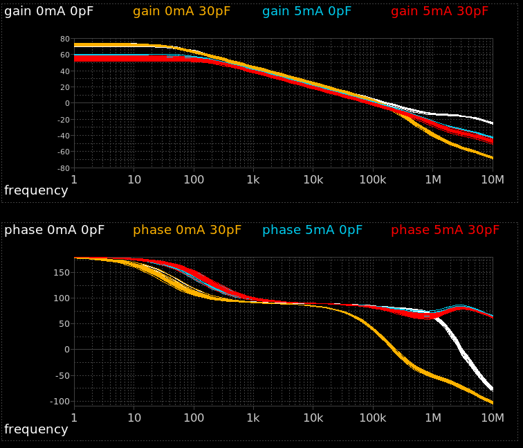
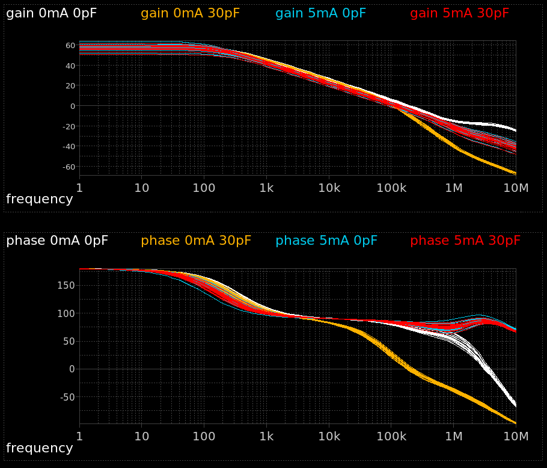
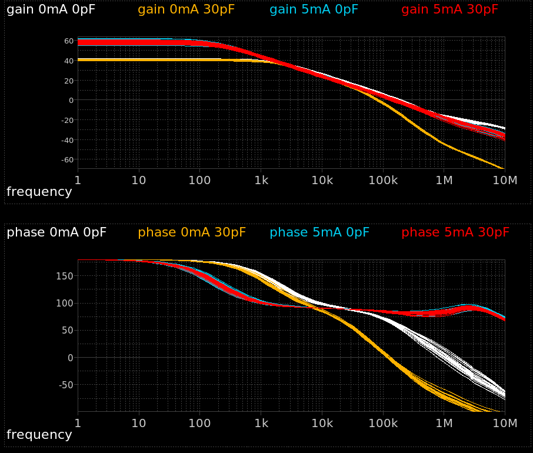

# SKY130 LDO with Folded Cascode OTA
Output-capless LDO for low-power PLL source voltage generation. The folded cascode OTA, and the constant current source, have been designed for 0.9 V to 1.8 V source voltage. The LDO operation begins at $V_{CC}$ = 1.5 V and is stable in the output current range 0-5 mA without load capacitance. 

|Parameter| Min | Typ | Max
|---|---|---|---|
| $V_{DD}$ (V) | 1.5  | 1.8 | 1.95 |
| $V_{out}$ (V) | 0.8 | 2*$V_{ref}$ | 1.95 |
| $V_{ref}$ (V) | 0.4 | $V_{out}$/2 | 0.975 |
| $V_{dropout}$ (mV) | 60 $^a$ | - | 200 $^b$|
| $I_{out}$ (mA) | 0 |-| 5 |
| $C_{load}$ (pF) | 0 |-| 30 |  
| $I_{q}$ (µA)   | 1.5 $^b$ |3| 4 $^a$ | 
| DC gain (dB)   | 40 | 57 | 74 | 
| Unit gain BW (kHz)   | 70 | 100 | 210 | 
| Phase margin (°)   | 20 | 75 | 90 |

$^a V_{DD}=1.95V$ fast corner  
$^b V_{DD}=1.60V$ slow corner  

## Monte Carlo Simulation 
LDO loop gain and phase at 
* $I_{out}$ = 0 mA or 5 mA
* $C_{load}$ = 0 pF or 30 pF
* $V_{DD}$ = 1.8 V 

### ss corner:
  

### tt corner:
  

### ff corner:
  

